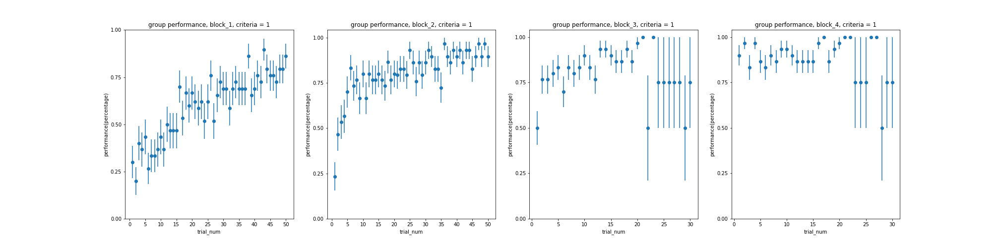
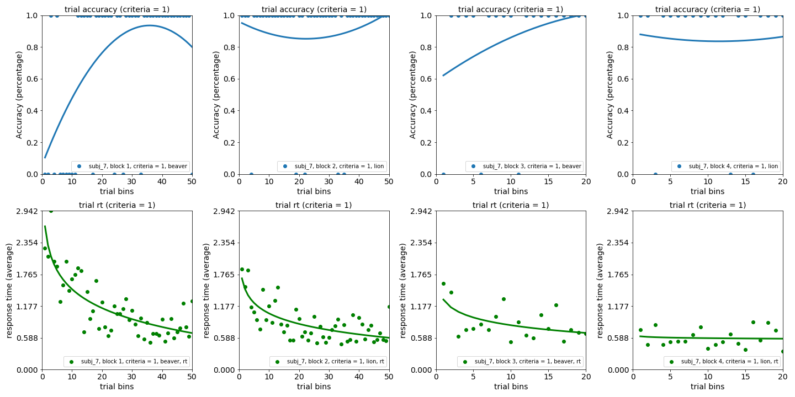
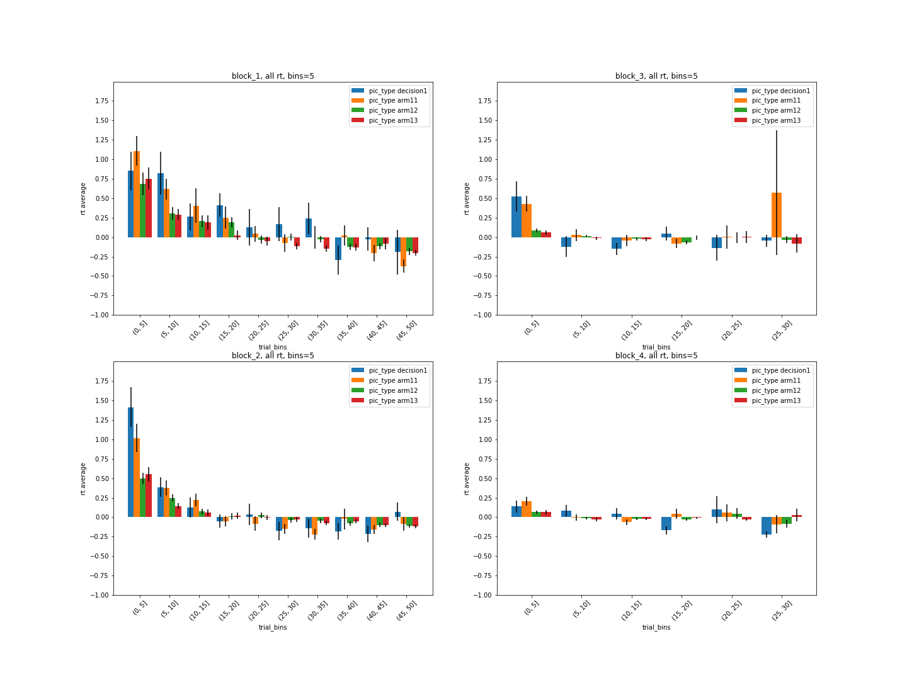

# **Data Analysis Portfolio**

repository containing portfolio of data analysis and data visualization projects completed by me for academic and cognitive psychology research purposes. Presented in the form of iPython Notebooks, and R markdown.

## Contents
### Data Analysis and Visualization with iPython
[_Examine the quality of the collected lab data_](https://github.com/yuany32/memory-research-analysis): Analysis of how well research participants performed in a designed "double-Y-maze" memory game, using correct number of trials and task durations as data quality indicators to explore what techniques human uses to learn and memorize tasks.  
- Some data visualization showcase:
  - Scatter plot with error bars of averaged trial accuracy for all participants
  

  - Scatter plot of one participant's trial accuracy with fit curve

  - Error bar plot of average reaction time for the first decision point and its consecutive images for all Participants

### Data Analysis and Visualization with R
[_Looking into immigration in the U.S._](https://info201a-wi20.github.io/project-report-yennhito/): Data analysis class group project at the information school, UW. The project focuses on various immigration indicators (admission rate, class of admission, apprehension rate, etc.) in the United States. The goal of the project is to advocate people and bring social awareness of the struggles that immigration population face with.
  - Skills: Data cleaning, wrangling, and visualizing; Git collaboration with branches
  - Group members: Michelle To, Jilly Tan, Mencius Chin

[_DubsTech data hackathon_]() (link coming soon): Using data analysis, visualization and machine learning model to determine the best FIFA club to join for a player who is under 25 years old.
  - My role in the team: Data cleaning, organizing and project management
  - Group members: Brian Kang, Nick Stoner, Lyons Lu, George Ma
